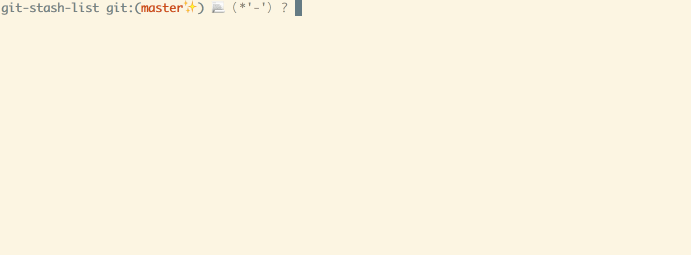

# git-multiple-stashes

Make git have multiple stash lists!

## Demo



## Dependencies

Emacs (>=24)

## Installation

Make git-stash-list visible from PATH

```
cp git-stash-list /usr/local/bin
```

and (optionally) add an alias to `~/.gitconfig`.

```
[alias]
stash-list = "!f() { git-stash-list $*; }; f"
```

## Usage

git-stash-list have following subcommands:

* `git stash-list list` ... Show list of all stash-lists.
* `git stash-list create <name>` ... Create new stash-list.
* `git stash-list delete <name>` ... Delete specified stash-list.
* `git stash-list show <name>` ... Show list of stashes in specified stash-list.
* `git stash-list switch <name>` ... Switch to specified stash-list.

